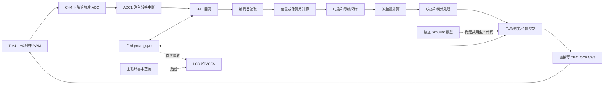

# 第一阶段只读盘点与基线

文档状态：已完成

盘点日期：2026-08-27

## 一、输入范围调整

用户已确认 `课程目录及开发计划/代码架构预研.md` 为误传材料，当前暂时排除。

处理方式：

- 原文件保留，不删除、不移动、不修改。
- 不再使用其中的目录结构、接口名称、架构结论、工期或验收数字。
- 本文的源码结论只依据当前源码、STM32Cube 配置、构建工程、历史产物和本机工具输出。
- 硬件结论区分“源码/配置事实”和“Markdown 文档中的说明”；没有实物或原始设计文件时不视为已验证。
- 后续架构草案由现状问题和用户提出的平台目标重新推导。

继续纳入的两份资料为：

| 文件 | 用途 | 文件哈希值 |
|---|---|---|
| `代码规范1.md` | 编码规则输入 | `3f6c6e380bf025e315b01cc4005a7112e8e4265c7136443a7c033e5f7093767c` |
| `Driver_Lab_P-Z-M_完整课程目录_V3.0.md` | 功能范围和实施顺序参考 | `ed39bb0e2384230fe6a1be1a858a68b4d3a0e202d531f83e57c81e79fc712d9c` |

两份有效资料的聚合哈希值为：

`c0910b84145f7cc98f847f0441371d229d77620dc110e831c211f35322cdac77`

被排除文件的哈希值单独记录为：

`eb4768b0c504b280838c1dc003255baa3b4cf4d0f563a4da1c4852dc73e9f180`

## 二、证据分级

- **源码事实**：可以在本地源码、工程文件、生成配置、二进制产物或工具输出中直接复核。
- **资料说明**：由用户手册或硬件报告描述，但缺少原始设计文件或实物测量。
- **工程判断**：根据源码事实推导出的风险或建议，需要通过构建、测试、回放或实测确认。

当前目录及其子目录均没有 `.git`。因此不能声明工作区“干净”，也不能确认来源提交、分支、历史标签和回退点。所有已有文件均按用户资产处理。

## 三、项目目录盘点

| 区域 | 现有内容 | 当前判断 |
|---|---|---|
| `AxDr原始代码/AxDr_L-main/AxDr_App` | 356 个文件，包含 STM32Cube、CMake、Keil、用户代码、USB、HAL/CMSIS 和历史产物 | 当前主固件工程 |
| `AxDr原始代码/AxDr_L-main/1.AxDr_Drag_VF` | 309 个文件，包含较早的变频阶段工程和产物 | 历史参考，不作为当前主工程 |
| `AxDr原始代码/AxDr_L-main/0.AxDr_simulink` | 25 个模型和一个参数脚本 | 独立模型资产，尚未形成共用生产代码的验证链 |
| `AxDr原始代码/AxDr_L-main/文档` | 三份 Markdown 文档 | 项目和硬件说明，需与源码及实物交叉核对 |
| `课程目录及开发计划` | 课程目录、编码规范和已排除的误传文件 | 只按上节声明的范围使用 |
| `Driver_lab` | 本轮前为空 | 新工作区候选位置 |

工作区在生成本文前共有 698 个文件。没有发现本地 PDF、Word、原理图工程、PCB 工程、Gerber、物料清单、FPGA/HDL 工程、自动化测试源码或持续集成配置。

硬件报告中存在指向远程 PNG 的链接，但本地没有可追踪网络和版本的原始原理图文件。

## 四、原始输入指纹

聚合算法为：按相对路径排序，对每个文件记录“相对路径、制表符、文件哈希值”，使用换行连接并在末尾添加换行，再计算 SHA-256。

| 输入集合 | 文件数 | 字节数 | 聚合哈希值 |
|---|---:|---:|---|
| `AxDr_App` 源码和工程输入 | 188 | 8,998,031 | `7016acb32e29873310b17ce5219b9e650052486cbff07a7ae00fc62bcd8fec93` |
| `1.AxDr_Drag_VF` 对应输入 | 148 | 8,683,873 | `94dbea9f9ef300a89822442b3e9bc87eeda059bc9e199e29803fa4a9eca9a516` |
| Simulink 模型和参数脚本 | 26 | 5,417,791 | `1cf270808d9c14459abef31d45ad86e6a08f6837fd1f1fb002dde2dc9dda29ec` |
| 原始工程的三份项目文档 | 3 | 66,045 | `eb2340d0966bcc50974614c1480e7e0138b5c903e2565c9396c10b46d94de5b6` |

这些指纹只能标识本轮看到的文件内容，不能恢复缺失的版本历史和许可证来源。

## 五、当前软件和实时链路

已确认的实时配置：

1. 芯片为 STM32G474RET6，系统和定时器时钟为 160 MHz。
2. TIM1 使用中心对齐模式 2，预分频为 0，周期为 4000，名义 PWM 频率约为 20 kHz。
3. TIM1 CH1 至 CH3 产生三相互补输出；CH4 下降沿用于触发注入 ADC，比较值为 3900。
4. ADC1 注入通道采样三相电流；ADC2 注入通道采样母线电压。两者使用同一触发，但只有 ADC1 开启注入转换中断。
5. 快速回调依次执行编码器读取、位置计算、采样、派生量、状态处理和控制计算。
6. 相电压来自常规 DMA，尚不能证明与注入电流属于同一时刻的完整快照。
7. `foc_drv.c` 直接写 TIM1 CCR1、CCR2 和 CCR3，当前没有唯一的板级最终输出管理者。
8. 源码给出的名义调度频率为：电流/FOC 20 kHz、速度环 10 kHz、位置环 5 kHz、速度测量 1 kHz。

这些频率是源码配置，不是示波器或时序测量结果。采样相位、PWM 生效延迟、中断最坏执行时间、抖动和栈高水位仍需实测。

## 六、硬件边界与接口

没有发现 FPGA 或 MCU 与 FPGA 的链路。当前平台边界是 STM32G474、模拟采样、栅极驱动和三相功率桥。

| 接口 | 资料说明 | 源码或配置状态 |
|---|---|---|
| 电源和电机 | 12 至 48 V 输入、A/B/C 三相输出 | 需确认实物板版本 |
| PWM 和栅极 | TIM1 六路互补输出 | 控制文件直接写寄存器，未收拢到板级边界 |
| 三相电流和母线 | 文档描述三相分流和母线分流 | 三相注入采样已使用；母线电流未进入控制数据 |
| 磁编码器 | 文档描述 SPI 接口 | SPI1 读取位于快速回调链路 |
| Hall | 文档描述三路 Hall | 引脚表与当前 `.ioc` 冲突，未建立可用链路 |
| FDCAN | 外设配置存在 | 主程序没有完成过滤、通知和业务启动链路 |
| USB 和串口 | USB CDC、USART3 115200 | 没有完整的命令协议，VOFA 发送被注释 |
| LCD 和外部存储 | 相关源码存在 | 片选和复位引脚与 2023 图纸存在冲突 |

资料和代码至少在 Hall、编码器、LCD 片选、温度和母线电流资源上不一致。板级准入条件应是确认实物板修订号，并依据通断测量建立权威引脚表。

## 七、源码模块与耦合

| 当前区域 | 现状职责和问题 |
|---|---|
| `Core/Src/main.c` | HAL 初始化、ADC/PWM 启动、电机初始化和 LCD 启动混在一起 |
| `foc_ctrl.c` | HAL 回调、快速调度、状态、模式、保护占位、标定和辨识编排混合 |
| `foc_drv.c` | 板卡/电机默认值、采样换算、控制环和 PWM 硬件访问混合 |
| `common.h` | 引入 `main.h` 与 `bsp.h`，集中大量类型、宏和全局 `pm`，使算法间接依赖 HAL |
| 数学和调节器文件 | 具有可移植潜力，但被总头文件和全局对象污染 |
| 估算器文件 | 部分分支未接通，部分状态位于全局变量，无法安全运行两个上下文 |
| `encoder.c` 和 `pos_calc.c` | 硬件采集、角度处理和算法选择没有清晰边界，存在空分支和指针风险 |
| 参数辨识和标定 | 实验流程、算法计算与活动参数修改没有分开 |
| 显示和遥测 | 直接读取全局 `pm`，没有一致只读快照 |

文件存在不等于模块已编译、被调用、完整或经过验证。当前若干声明没有定义，IPD 实现被注释，部分估算器选择分支为空，HFI 等模块仍有上下文外可写状态。

## 八、安全现状

以下问题会阻止当前阶段进行带功率运行：

- TIM1 死区配置为 0。
- TIM1 Break、Break2、数字/比较器 Break 源和自动输出均禁用。
- 快速回调中的 `pmsm_fault_check()` 被注释，函数本身也没有完整相电流过流处理。
- ADC 和 CH4 在 `pmsm_init()` 前启动，中断可能在全局对象初始化完成前进入。
- `pmsm_init()` 在中断已经开启的情况下执行较长的电流零偏采集。
- 初始化阶段直接调用 `foc_pwm_start()`，状态处理也可以再次启动 PWM。
- `foc_get_curr_off()` 使用未初始化的 `sum_a`、`sum_b` 和 `sum_c` 累加采样。
- 母线电压参与除法前没有零值和有效性保护。
- ADC 回调未检查传入句柄，后续若开启第二个注入中断可能重复执行快速周期。

硬件报告中关于栅极驱动器内部保护的描述不能代替 MCU Break 到 Gate 的实测证据。

## 九、构建与运行基线

### 本机工具

- CMake 4.4.2、Ninja 1.13.2、ARM GCC 16.1.0 和 Newlib 4.6 可用，但没有继承到当前进程环境变量。
- 本机存在 Keil μVision 5.40 和 Arm Compiler 6.22。
- 工程指定的 `Keil.STM32G4xx_DFP.2.0.0` 未安装。
- 安装了 J-Link V9.70，但当前未枚举到 J-Link、STM32 或相关串口设备。
- 未发现可用 MATLAB。

### 历史固件产物

| 产物 | 大小 | 哈希值 |
|---|---:|---|
| `AxDr.axf` | 853,896 字节 | `79efe21aa1167f4ce97c4439ca96a5a3e1caf1c6988e162caf1d5b1a365ad213` |
| `AxDr.hex` | 255,517 字节 | `81550c7d94c15340ef5aa2e6c030fd1779f68b5b8b489623a283882b2a1608a0` |
| `AxDr.map` | 629,890 字节 | `74f89e7c9a5371448d957bf1dbcabcbe52ef3a67a8aa65f8c3f8dd1fa2253938` |
| `AxDr.ioc` | 24,837 字节 | `5422b750db0fb8c4de21c9a4d71d875af9d17e438fba19e4848747bcffbbd41f` |

`fromelf` 可解析 AXF：代码 74,240 字节、只读数据 15,992 字节、读写数据 50,752 字节、零初始化数据 9,928 字节。HEX 有 5,681 条记录、90,832 个数据字节、一个结束记录，校验失败为 0。

这些是历史产物证据，不是本机从空目录完成的重新构建。旧日志来自另一版本的 μVision 和 ArmClang；其中后续“零错误”记录没有编译行，属于增量空构建的可能性很高。

### 当前编译检查

- ArmClang 6.22 按 Keil 的 66 个 C 文件清单逐文件进行语法检查：66 个全部通过，产生 4 个警告。
- ARM GCC 16.1 按当前 CMake 实际包含路径检查 `main.c`：因找不到 `modlue.h` 失败。
- ARM GCC 使用临时补齐的 Keil 等价清单检查：66 个文件中 64 个通过；`encoder.c` 存在接收缓冲区指针类型错误，`lcd.c` 的四个空数组不符合当前 C11 编译要求；共记录 89 条诊断。
- 顶层 CMake 完全遗漏 `User/moldue`，同时通过预设和顶层脚本重复加载工具链文件。
- 当前没有 CTest、主机可执行程序、单元测试、回放程序或可安全执行的目标机测试。

因此本阶段的准确结论是：

> 历史固件产物完整性已验证，当前 ArmClang 语法基线已建立；可重复的完整固件构建和可运行测试基线尚未通过，已明确转入下一阶段处理。

## 十、核心风险与缺口

1. 没有 Git 历史、不可变来源版本、许可证清单和回退标签。
2. 没有本地权威原理图、PCB、物料清单或已确认的板卡修订号。
3. CMake 与 Keil 源码清单不一致，当前无法从空目录完成可重复构建。
4. 没有主机测试、回放、仿真共用代码和持续集成。
5. 硬件、状态、算法、参数、诊断和通信共享一个大型可写全局对象。
6. 启动、Gate、Break 和故障到输出的安全边界没有建立。
7. 数据没有统一周期号、单调时间、有效状态、完整命令事务和一致状态快照。
8. 实际施加输出与内部请求没有区分，估算器输入语义不完整。
9. 电流采样拓扑和采样时刻被隐含在实现中，难以扩展单电阻重构。
10. 参数、标定、辨识结果和模型常量没有版本化的统一来源。
11. 部分算法资产不完整、未接线、全局有状态或存在未定义行为。
12. 尚未定义统一设备对标的工况、数据和指标，但核心架构不能依赖 Elmo 工装。

## 十一、阶段验收

| 验收项 | 结果 |
|---|---|
| 原始源码、模型、配置和产物未修改 | 通过 |
| 目录、构建、工具链、硬件、实时链路和测试盘点 | 通过 |
| 误传架构材料已从有效输入中排除 | 通过 |
| 历史产物和源码输入指纹已记录 | 通过 |
| 当前语法检查基线已记录 | 通过 |
| 本机完整固件重新构建 | 未通过，存在已定位阻塞 |
| 主机和回放运行基线 | 未通过，当前没有运行入口 |
| 带功率板卡基线 | 未执行，安全条件不足且不属于本阶段验收 |

