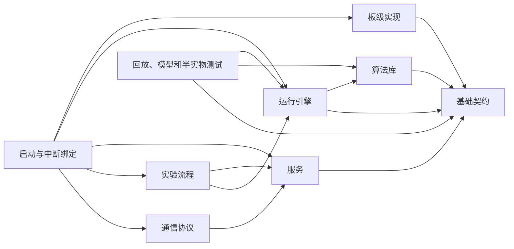

# 算法复现平台目标架构草案

文档状态：重新提出的设计建议，尚未冻结

## 一、依据与边界

本文不使用已排除的 `代码架构预研.md`。

架构只依据：

- 当前源码、工程配置和第一阶段基线揭示的耦合与风险；
- 用户提出的参数辨识、自整定、数据采集、离线回放、仿真、半实物测试和未来 Elmo 对标目标；
- 课程目录提供的功能范围；
- `代码规范1.md` 中经项目勘误后仍然有效的编码要求。

下文目录、模块和接口均为本次重新提出的建议，不是现有事实，也不代表接口已经冻结。

## 二、建设原则

1. 保留现有板卡和算法资产，采用渐进迁移，不整体推倒重写。
2. 算法实现与 STM32、HAL、寄存器、通信和显示解耦。
3. 板级层是 ADC、PWM、Gate 和 Break 的唯一最终执行者。
4. 快速周期只做有界、确定时长的采样、计算和输出提交。
5. 所有可变算法状态进入显式上下文，不新增跨模块可写全局对象。
6. 每项物理量明确单位、方向、时间、有效性和所有权。
7. 固件、主机回放、仿真和半实物测试尽量复用同一套生产 C 源码。
8. 参数辨识和自整定只产生候选参数，不直接无条件修改活动控制参数。
9. Elmo 只作为未来对标设备适配器，不进入固件和核心算法依赖。
10. 安全和可验证性优先于目录美观或一次性大规模整理。

## 三、建议目录结构

源码目录使用小写英文和下划线，中文用于文档与报告，以避免编译器、脚本和跨平台路径问题。

```text
Driver_lab/
├─ source/
│  ├─ foundation/       基础类型、单位、时间、错误码和公共契约
│  ├─ algorithms/       数学、调节器、轨迹、估算器和算法复现实现
│  ├─ engine/           电机运行上下文、状态推进和周期编排
│  ├─ board/
│  │  └─ axdr_g474/     ADC、PWM、编码器、Gate、Break 和板级换算
│  ├─ services/         参数、标定、诊断、命令收件箱和数据记录
│  ├─ experiments/      参数辨识、自整定和受控激励流程
│  ├─ protocols/        USB、串口、FDCAN 和遥测编码
│  └─ startup/          初始化顺序、中断绑定和模块组合
├─ workstation/
│  ├─ offline_replay/   离线回放
│  ├─ plant_model/      电机、逆变器、负载和传感器模型
│  ├─ hil_bridge/       半实物测试接口
│  ├─ benchmark/        统一工况和设备对标
│  └─ report_tools/     指标、绘图和中文报告
├─ verification/
│  ├─ unit_cases/       数学和算法单元验证
│  ├─ module_cases/     运行引擎和服务验证
│  ├─ scenario_cases/   启停、切换、异常和故障场景
│  ├─ replay_cases/     数据回放与回归
│  └─ hardware_cases/   板级时序和安全验证
├─ model_assets/        模型及参数
├─ data_assets/         数据集、工况和期望结果
└─ 文档/               全中文说明、记录和报告
```

## 四、依赖方向



依赖约束：

- `algorithms` 不得包含 HAL、寄存器、USB、FDCAN、LCD 或板卡头文件。
- `engine` 不得直接读取 ADC 或写 PWM。
- `board` 不包含电流环、速度环、估算器和实验策略。
- `protocols` 不能访问运行引擎的私有上下文，只能提交完整命令或读取已发布报告。
- `startup` 只负责组合、初始化和调用顺序，不承载算法实现。
- 主机端复用 `foundation`、`algorithms` 和 `engine` 的生产源码。
- 禁止通过新的总头文件重新形成当前 `common.h` 式耦合。

## 五、快速周期链路

```text
板级采集原始数据
  ↓
生成带周期号和采样时刻的采样批次
  ↓
完成偏置、比例、方向和有效性换算
  ↓
运行引擎锁存本周期完整命令和只读参数
  ↓
执行角度处理、估算、调节和调制计算
  ↓
生成逆变器请求
  ↓
板级执行限幅、最小脉宽、相序映射和最终安全许可
  ↓
写入 PWM/Gate 并记录实际采用结果
  ↓
发布本周期一致只读报告
```

建议函数边界如下，名称尚未冻结：

```c
bool board_acquire_sample(sample_batch_t *sample);

void engine_fast_step(
    motor_engine_t *engine,
    const motor_measurement_t *measurement,
    const inverter_receipt_t *previous_receipt,
    inverter_request_t *request);

void board_apply_request(
    const inverter_request_t *request,
    inverter_receipt_t *receipt);

void engine_slow_step(
    motor_engine_t *engine,
    const service_command_t *command);
```

快速周期内禁止动态内存、Flash 擦写、屏幕刷新、阻塞通信、等待锁、无界循环和复杂报告统计。

## 六、核心数据契约

| 建议对象 | 主要内容 | 唯一写者 |
|---|---|---|
| `cycle_mark_t` | 周期号、单调时间、采样相位 | 板级时基 |
| `sample_batch_t` | ADC、编码器或 Hall 原始数据和有效位 | 板级采集 |
| `motor_measurement_t` | 统一单位的电流、电压、角度、速度、温度和有效性 | 板级换算 |
| `motor_setpoint_t` | 模式、目标量、斜坡、安全限制和命令版本 | 命令服务 |
| `inverter_request_t` | 调制或占空比请求、使能请求 | 运行引擎 |
| `inverter_receipt_t` | 限幅后实际占空比、母线、Gate 状态和拒绝原因 | 板级输出 |
| `runtime_report_t` | 状态、故障、反馈、算法诊断和周期标记 | 运行引擎 |
| `parameter_bundle_t` | 电机、机械、调节器和估算器参数 | 参数服务 |
| `calibration_bundle_t` | 偏置、增益、相序、零位和传感器标定 | 标定服务 |
| `trace_record_t` | 可回放的输入、输出、状态和版本信息 | 记录服务 |

共同规则：

- 每个共享对象只有一个写者。
- 快速周期读取的参数在本周期内保持不变。
- 通信和显示只能读取已发布报告，不能访问运行引擎内部成员。
- 估算器使用上一周期板级实际接受的逆变器结果，不能把未经限幅的请求当成实际电压。
- 所有物理量必须定义单位、正方向、范围、有效条件和时间归属。
- 传输和文件格式必须显式定义字段宽度、字节序和版本，不能直接依赖结构体内存布局。

## 七、状态与输出所有权

建议把当前混合状态拆为独立维度：

- 功率状态：断开、准备、允许、故障锁定；
- 控制模式：电压、电流或转矩、速度、位置；
- 启动阶段：空闲、对齐、开环加速、估算捕获、闭环；
- 反馈来源：开环、编码器、Hall、估算器。

每次转换都要定义前置条件、进入动作、退出动作、超时、失败后的安全去向，以及需要清零、保持或平滑接续的算法状态。

只有板级模块可以操作 PWM、Gate 和 Break。通信只能提出请求；运行引擎生成候选输出；板级安全许可拥有最终否决权。

上电、复位、故障清除后的第一周期以及无效反馈、命令超时状态下，默认不允许功率输出。

## 八、算法复现接口

每个算法模块至少包含：

- 中文说明、来源、版本、适用条件和许可证；
- 输入、输出、单位和采样周期；
- 参数结构和运行状态结构；
- 初始化、复位和单步接口；
- 有效性与诊断输出；
- 基准向量或可复现实验数据；
- 已知限制和公平对比工况。

采用编译期静态选择或静态登记，不在实时固件中引入动态插件加载、复杂工厂或服务容器。未完成或未验证的算法保留在实验区，不进入发布路径。

## 九、参数辨识和自整定

参数辨识流程：

```text
建立实验计划
  → 检查硬件、传感器和安全条件
  → 施加受限激励并采集数据
  → 计算候选参数和可信度
  → 回放或仿真复核
  → 生成候选参数包
  → 用户或规则批准
  → 在安全状态提交
  → 回归验证并保留旧版本
```

自整定同样输出“候选参数包和验证证据”，不得在快速周期内直接修改正在使用的调节器或估算器参数。

每个结果记录电机、板卡、固件、温度、母线、负载、数据区间、算法版本、单位、可信度、拒绝原因和回退信息。

## 十、数据采集与离线回放

固件使用固定容量、非阻塞缓冲区。记录至少包含：

- 格式版本、固件构建身份、板卡/电机/传感器身份；
- 参数和标定版本、实验编号；
- 周期标记、原始采样、换算后反馈；
- 完整命令、逆变器请求和实际采用结果；
- 状态、故障、有效性和丢包/覆盖标记。

主机回放重新调用同一套运行引擎和算法源码，支持逐拍执行、替换单个算法、替换参数、注入故障、新旧实现比较和中文报告。记录格式采用版本化紧凑二进制，主机工具可以导出 CSV 等分析格式；最终格式另行决策。

## 十一、仿真、半实物测试与 Elmo 对标

电脑模型只替代电机、逆变器、负载、传感器和板级环境，不复制控制算法。

```text
电脑模型或半实物设备
  ↔ 公共采样/输出契约
  ↔ 运行引擎
  ↔ 同一套算法源码
```

统一场景描述应包含初始条件、参数版本、命令轨迹、负载和母线变化、噪声/延迟/故障、安全终止条件和指标。

未来 Elmo 只接入主机端对标模块。分别实现自研驱动器、电脑模型、半实物设备和 Elmo 适配器，共享同一工况、数据和指标接口。当前无 Elmo 时，构建、回放、仿真和验证仍应完整成立。

## 十二、现有源码迁移方向

| 现有资产 | 建议迁移方向 |
|---|---|
| `Core/Src/main.c` | `startup` 和部分 `board` |
| ADC、TIM、GPIO 等生成文件 | `board/axdr_g474` 的生成代码边界 |
| `User/bsp` | `board/axdr_g474` |
| `foc_calc.c` | `algorithms/foc` |
| `pid.c`、`pll.c`、`trap_traj.c` | 调节器、估算和轨迹算法 |
| 估算器文件 | `algorithms/estimation`，未验证实现进入实验区 |
| `foc_ctrl.c` | 拆入 `engine`、`startup` 和实验流程 |
| `foc_drv.c` | 拆入 `board`、`engine`、`algorithms` 和 `services` |
| `common.h` | 基础契约、模块私有头和显式运行上下文 |
| `encoder.c`、`pos_calc.c` | 板级传感器采集和可移植角度处理 |
| `idpm.c` | `experiments/identification` |
| 标定和齿槽补偿文件 | 实验流程、参数服务和算法模块 |
| `vofa.c` | `protocols/telemetry` |
| LCD、显示和外部存储 | 板级外设与后台服务 |
| Simulink 模型 | 主机模型输入资产，后续接入共用算法 |
| Drag VF 工程 | 只读历史参考，不进入新产品源码清单 |

迁移前只建立映射；每次只移动一个职责或算法族，不一次性搬空旧工程。

## 十三、架构验收条件

1. 算法目录不包含 HAL、STM32、BSP、通信和显示头文件。
2. 运行引擎不读 ADC 寄存器、不写 PWM 寄存器。
3. PWM、Gate 和 Break 的最终硬件写入只存在于板级模块。
4. 通信和显示不能访问运行引擎私有上下文。
5. 两个运行上下文交错初始化、复位和单步执行时互不污染。
6. 上电、复位、故障清除后的第一周期不请求 PWM。
7. 完整命令在快速周期内不会出现字段撕裂；状态、故障和诊断属于同一个发布序号。
8. 回放能够验证估算器使用上一周期实际输出，包括限幅和 Gate 禁止场景。
9. 虚拟电流采样能够表达三电阻和未来单电阻的采样点、窗口和有效性。
10. 主机、回放、仿真和目标机使用同一份生产算法源码清单。
11. 参数辨识和自整定结果先进入候选参数包，可审核、验证和回退。
12. 板级阶段用实测验证 PWM 极性、有效死区、ADC 时刻、Break 到 Gate 延迟、中断时长、抖动、栈和内存。

## 十四、待确认事项

- `Driver_lab` 是否正式作为新源码工作区，以及版本控制放置位置；
- 实物板修订号和权威引脚表；
- 物理量统一单位、方向和时间基准；
- 快慢路径共享数据采用原子操作、短临界区还是双缓冲；
- 类型名、枚举前缀和格式化配置；
- 参数/标定持久化格式和原子提交机制；
- 数据记录格式和版本升级方式；
- 浮点容差、异常数值和跨编译器一致性规则；
- Simulink 在主机模型链中的角色和许可证条件；
- CMake 与 Keil 之间源码清单的权威来源；
- 后续 Elmo 可用的通信方式、控制模式和反馈量。

