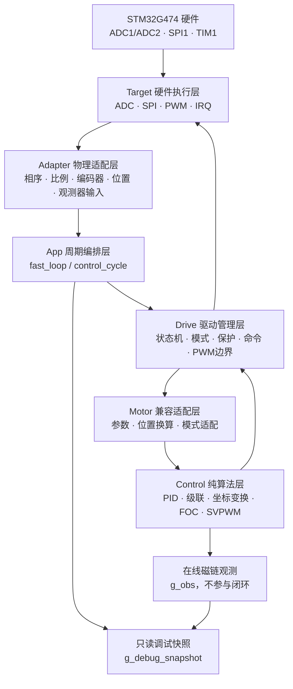
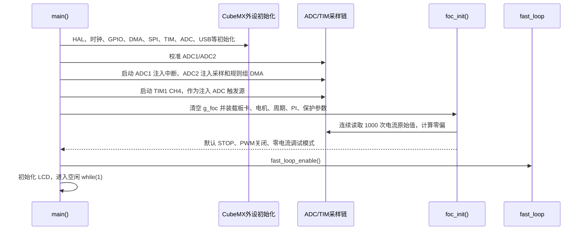
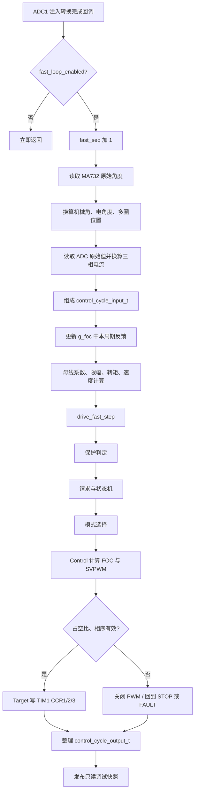
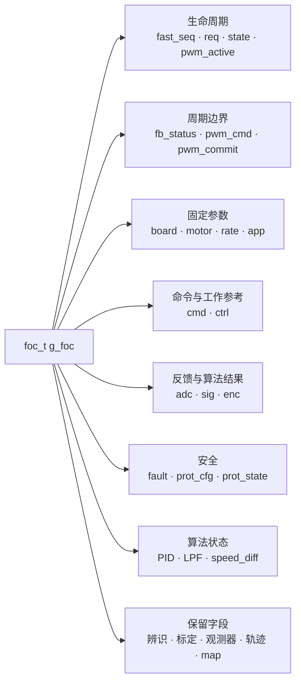
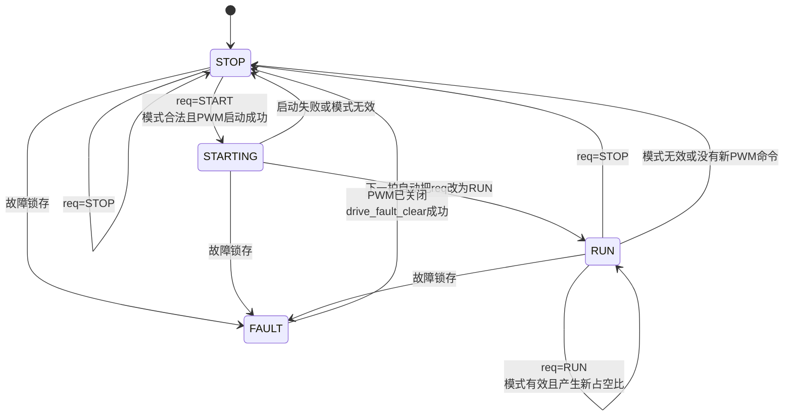
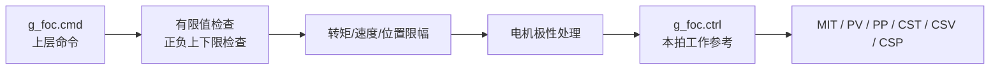
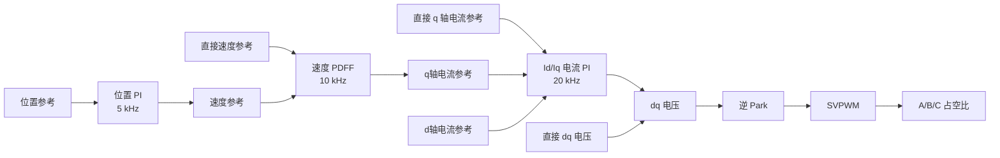

# AxDr_L 完整代码框架、状态机与算法详解

> 文档目的：让第一次接触本工程的人能够沿着一条明确主线，读懂“系统如何启动、一次控制中断
> 做了什么、模式如何选择、FOC 如何算出占空比、占空比如何进入 TIM1、故障如何关断输出”。
>
> 本文以当前分支 `refactor/architecture-goal` 的正式固件为准。实验算法虽然仍保留在仓库，
> 但已经从正式 CMake/Keil 构建清单移出，本文会把“正式运行代码”和“保留资料代码”明确分开。

---

## 1. 先用一句话理解整个程序

这个程序本质上每 50 μs 做一次下面的事情：

```text
读取角度和电流
  -> 判断反馈、故障、启停状态和运行模式
  -> 根据模式执行电压环/电流环/速度环/位置环
  -> FOC 和 SVPWM 算出 A、B、C 三相占空比
  -> 检查占空比和相序
  -> 写入 TIM1 的 CCR1、CCR2、CCR3
```

其中最重要的分层原则是：

- `App` 只安排“一拍控制先做什么、后做什么”；
- `Drive` 决定“现在能不能运行、应该运行哪种模式、是否必须关 PWM”；
- `Control` 只负责数学计算，不碰 ADC、SPI、TIM 和 HAL；
- `Target` 只负责当前 STM32G474 的硬件读写；
- `Adapter` 把原始硬件数据换算为控制算法使用的物理量；
- `Motor` 暂时承接模式换算和历史字段到 FOC Core 的薄连接。

---

## 2. 正式架构总图



### 2.1 各层只做什么

| 层 | 主要目录 | 负责 | 不应该负责 |
|---|---|---|---|
| App | `User/app` | 快速周期顺序、显式周期输入输出、调试快照 | FOC 公式、直接读寄存器 |
| Drive | `User/drive` | 启停、状态、模式、命令、保护、PWM 提交边界 | Clarke/Park、SPI、ADC 寄存器 |
| Control | `User/control` | 纯 C11 数学算法和算法状态 | HAL、全局 `g_foc`、硬件时序 |
| Target | `User/bsp/target_*` | 当前芯片的 ADC、编码器 SPI、TIM1 | 电机模式和控制策略 |
| Adapter | `User/adapter` | 原始计数到安培、伏特、弧度的换算 | FOC 算法和寄存器操作 |
| Config | `User/config` | 电机、驱动板和编码器的硬件参数 | 算法运行状态 |
| Motor | `User/motor` 中正式文件 | 旧对象到新 Core 的过渡映射 | 新增硬件寄存器直连 |
| Display | `User/moldue` | LCD 初始化和显示 | 快速控制和保护决策 |

目录名 `moldue` 是历史拼写，目前没有为了改名字而扩大修改范围。

---

## 3. 哪些代码真正进入正式固件

当前 CMake 和 Keil 都包含 48 个用户 C 源文件。

### 3.1 正式运行源文件

| 模块 | 文件 | 核心作用 |
|---|---|---|
| App | `control_cycle.c` | 把一拍物理输入送入 Drive，并整理一拍输出 |
| App | `fast_loop.c` | 快速周期执行顺序 |
| App | `debug_snapshot.c` | 在一拍结束时复制只读调试数据 |
| Target | `target_adc.c` | 读取三相电流、相电压和母线 ADC 原始计数 |
| Target | `target_encoder.c` | 用 SPI1 读取 MA732 或 MT6816 原始位置 |
| Target | `target_irq.c` | 把 STM32 ADC 回调连接到快速周期 |
| Target | `target_pwm.c` | 启停六路主/互补 PWM，写 TIM1 比较值 |
| Adapter | `board_adapter.c` | 相序映射、零偏扣除和 ADC 物理量换算 |
| Adapter | `encoder_adapter.c` | 编码器配置、原始读取和单圈角换算 |
| Adapter | `position_adapter.c` | 电角度、转子和输出轴位置更新 |
| Adapter | `observer_adapter.c` | 把 FOC 物理量送入在线磁链观测器 |
| Control | `control_limit.c` | 通用上下限裁剪 |
| Control | `control_filter.c` | 一阶低通滤波器 |
| Control | `control_speed.c` | 角度差分测速 |
| Control | `control_pid.c` | 并联 PID、串联 PID、PDFF |
| Control | `control_cascade.c` | 电流、速度、位置三级控制 |
| Control | `control_mit.c` | MIT 位置、速度和前馈转矩合成 |
| Control | `control_traj.c` | 速度斜坡和在线梯形位置轨迹 |
| Control | `foc_transform.c` | Clarke、Park、逆 Park |
| Control | `foc_core.c` | FOC 输入整理和调制主链 |
| Control | `foc_svm.c` | 六扇区 SVPWM |
| Control | `foc_control.c` | 电压/电流/速度/位置统一入口 |
| Drive | `drive.c` | Drive 状态机和功率动作 |
| Drive | `drive_mode.c` | 模式合法性检查和模式分派 |
| Drive | `drive_command.c` | 正式命令检查、限幅和极性 |
| Drive | `drive_protection.c` | 保护计数、判定和故障锁存 |
| Drive | `drive_pwm.c` | 逻辑占空比检查、相序映射和提交 |
| Drive | `drive_reset.c` | 停机/启动时清理控制器历史状态 |
| Motor | `motor_modes.c` | 当前放行模式到 Control 的适配 |
| Motor | `foc_drv.c` | 参数初始化、反馈更新、FOC 兼容入口 |
| Motor | `util.c` | 历史查表三角函数和序列化工具 |
| Display | `display.c` | 当前电机数据的 LCD 显示入口 |
| Display | `lcd.c` | ST7789 LCD 底层绘图函数 |

### 3.2 保留在仓库、但不进入正式固件的代码

| 类别 | 文件或功能 | 当前处理 |
|---|---|---|
| 参数辨识 | `idpm.c` | 保留资料，未放行 |
| 标定与齿槽补偿 | `calibration.c`、`anticogging.c` | 保留资料，未放行 |
| 旧轨迹 | `trap_traj.c` | 仅保留资料；正式链使用 `control_traj.c` |
| 无感角度观测器 | `alob.c`、`nlob.c`、`scvm.c`、`hfsi.c`、`pll.c` 等 | 保留资料，未放行 |
| 其他编码器组合 | 旧 `encoder.c`、旧 `pos_calc.c` | 正式链只允许配置选中的单编码器；当前为 MA732 |
| 旧外设包装 | `bsp_cpu/fdcan/flash/gpio/uart.c` | 尚未形成正式协议边界，不链接 |
| VOFA | `vofa.c` | 不链接，避免调试通信混入快速链 |

所以“源码目录里还有这些文件”和“正式固件会运行这些功能”是两回事。

---

## 4. 上电初始化流程

### 4.1 启动时序图



### 4.2 `main()` 的实际顺序

1. `HAL_Init()`；
2. `SystemClock_Config()`；
3. 初始化 GPIO、DMA、SPI1、TIM1、TIM3、USB、ADC1、ADC2、UART、FDCAN、SPI3；
4. 校准 ADC1、ADC2；
5. ADC1 注入组使用中断启动，ADC2 注入组普通启动；
6. ADC1/ADC2 规则组使用 DMA 循环采样；
7. 启动 TIM1 CH4，比较值设为 3900，用其下降沿触发两个 ADC 注入组；
8. 调用 `foc_init()`；
9. 调用 `fast_loop_enable()`，从这一步才允许中断访问已初始化的 `g_foc`；
10. 初始化 LCD；主循环目前不承担电机控制。

### 4.3 为什么初始化时中断已经开始，却不会提前跑电机控制

`fast_loop.c` 内有：

```c
static volatile bool fast_loop_enabled = false;
```

虽然 ADC 中断在 `foc_init()` 以前已经启动，但 `fast_loop_step()` 看见该标志仍为 `false` 就直接返回。
这样既能让 ADC 持续产生零偏采样，又不会让控制中断读取一个正在初始化的 `g_foc`。

### 4.4 电流零偏

`foc_get_curr_off()` 连续读取 1000 次 ADC1 注入结果，每次间隔 1 ms，分别累加三条物理采样链，
最后求平均值作为 `ia_off/ib_off/ic_off`。相序是 ACB 时，B、C 的零偏也同步交换。

这个过程大约需要 1 秒，目的是得到“零电流时 ADC 应该是多少计数”。

---

## 5. 硬件定时与接口

### 5.1 TIM1 PWM

| 项目 | 当前配置 |
|---|---|
| TIM1 时钟 | 160 MHz |
| 计数方式 | 中心对齐 2 |
| Prescaler | 0 |
| ARR | 4000 |
| PWM 频率 | 约 160 MHz / (2 × 4000) = 20 kHz |
| CH1/2/3 | 三相 PWM 主通道 |
| CH1N/2N/3N | 三相互补通道 |
| CH4 | ADC 注入转换触发时间点 |
| DeadTime | 80 个计数，软件目标约 0.5 μs |
| Break/Break2 | 当前关闭，尚未映射硬件故障源 |

### 5.2 ADC

| ADC | 数据 | 方式 | 触发/更新 |
|---|---|---|---|
| ADC1 注入 Rank1/2/3 | 三条电流采样链 | JDR1/JDR2/JDR3 | TIM1 CH4 下降沿 |
| ADC2 注入 Rank1 | 母线电压 | JDR1 | TIM1 CH4 下降沿 |
| ADC2 规则组 | 三相电压等 | DMA `adc2_buff[]` | 连续规则转换 |

控制周期由 ADC1 注入完成回调驱动。ADC2 注入组与 ADC1 使用相同 TIM1 触发，但最终是否完全同拍、
ADC2 JDR1 在 ADC1 回调时是否已经是本次触发的新值，仍需要示波器/寄存器实测确认。

### 5.3 编码器 SPI

| 项目 | 当前配置 |
|---|---|
| 编码器 | MA732（代码同时保留 MT6816 Target/Adapter） |
| SPI | SPI1，主机，16 位，Mode 3，MSB first |
| 分频 | 32，当前时钟下约 5 Mbit/s |
| 读取命令 | `0x0000` |
| 结果 | 一帧响应的 bit15～bit2，得到 14 位计数 |
| 超时 | 本帧等待阶段最多轮询 200 次 |

SPI 读取是同步有界轮询，不会无限卡死。任一帧失败，本周期 `pos_valid=false`，旧位置不会伪装成新数据。

---

## 6. 一次 20 kHz 快速控制周期到底做了什么

### 6.1 完整流程图



### 6.2 对应函数顺序

```text
HAL_ADCEx_InjectedConvCpltCallback()
  -> fast_loop_step(&g_foc)
       -> encoder_sample()
       -> position_update()
       -> foc_adc_sample()
       -> control_cycle_step()
            -> ctrl_fb_update()
            -> drive_fast_step()
                 -> drive_update_protection()
                 -> drive_exec_action()
                 -> drive_mode_step()
                 -> foc_volt/cur/spd/pos_step()
                 -> foc_ctrl_step()
                 -> drive_pwm_commit()
                 -> target_pwm_set_duty_ratios()
       -> debug_snapshot_publish()
```

### 6.3 角度和电流是不是“同时更新”

它们属于同一个 `fast_seq`，但不是同一个物理时刻：

1. TIM1 CH4 触发 ADC；
2. ADC1 注入转换完成后进入中断；
3. 中断里先用 SPI 读取编码器；
4. 再读取已经锁存在 ADC JDR 中的电流值。

所以 ADC 电流的物理采样时刻在前，编码器 SPI 读出的角度时刻在后。软件把二者当作这一控制拍的反馈使用。
当前框架已经把顺序固定且可测试，但它们之间的实际时间差、是否需要角度预测补偿，要等上电测出 SPI 和中断耗时后决定。

---

## 7. 核心对象 `g_foc` 怎么理解

全局对象：

```c
_RAM_DATA foc_t g_foc;
```

它目前仍是整个电机实例的总上下文。重构没有强行拆掉它，而是让各层通过小接口使用它，避免一次性改变
全部旧算法内存布局。

### 7.1 `g_foc` 的核心组成



### 7.2 最重要的顶层字段

| 字段 | 大白话含义 | 谁主要写 |
|---|---|---|
| `fast_seq` | 当前是第几拍快速控制 | App |
| `mode` | 当前系统模式和子模式 | 上层命令/调试器，Drive 读取 |
| `req` | 希望 Drive 做 STOP、START 还是 RUN | 上层命令/Drive |
| `state` | Drive 本周期实际处于 STOP、STARTING、RUN、FAULT | Drive |
| `pwm_active` | 软件是否认为三相 PWM 已经启动 | Drive |
| `fb_status` | 电流、母线、位置反馈是否有效 | Control Cycle |
| `pwm_cmd` | 本周期算法希望提交的逻辑 A/B/C 占空比 | Drive PWM |
| `pwm_commit` | 最近一次已经调用 Target 写寄存器的逻辑占空比 | Drive PWM |
| `fault` | 面向整机使用的故障位图 | Drive |
| `prot_cfg/prot_state` | 保护阈值、连续计数和锁存结果 | 初始化/Protection |

### 7.3 参数、命令、反馈和控制状态不要混淆

| 对象 | 内容 | 是否经常变化 |
|---|---|---|
| `g_foc.motor` | 电机固有参数：电阻、电感、磁链、极对数、减速比、零位 | 通常不变 |
| `g_foc.board` | 板卡参数：ADC 参考、电流/电压比例、死区 | 通常不变 |
| `g_foc.cmd` | 上层正式命令：转矩、速度、位置、MIT 参数 | 上层更新 |
| `g_foc.ctrl` | 控制内部正在使用的给定、限制和中间参考 | 每拍或各环更新 |
| `g_foc.adc` | ADC 原始计数和零偏 | 每拍更新 |
| `g_foc.sig` | 物理反馈、dq 量、速度、转矩、电压和占空比 | 每拍更新 |
| `g_foc.rate` | 各环频率、周期和分频计数 | 计数每拍更新 |

正式模式使用 `g_foc.cmd` 作为外部命令，再由 `drive_cmd_apply()` 检查后写入 `g_foc.ctrl`。
调试模式直接使用 `g_foc.ctrl`，适合在调试器里手工给很小的电压或电流。

---

## 8. 变量命名怎么读

### 8.1 常用前缀

| 缩写 | 含义 | 常见单位 |
|---|---|---|
| `i` | current，电流 | A |
| `v` | voltage，电压 | V |
| `p`、`pos` | position，位置 | rad |
| `w` | angular speed，角速度 | rad/s |
| `tor` | torque，转矩 | N·m |
| `dtc`、`duty` | PWM 占空比 | 0～1 |
| `e` | electrical，电气侧 | rad 或 rad/s |
| `r` | rotor，转子侧 | rad、rad/s、N·m |
| `m` | mechanical output，减速器输出侧 | rad、rad/s、N·m |

### 8.2 常用后缀

| 后缀 | 含义 | 示例 |
|---|---|---|
| `_set` | 原始设定值 | `iq_set` |
| `_ref` | 当前参考值 | `wm_ref` |
| `_lim` | 经过限幅或用于限制 | `iq_lim` |
| `_f` | 滤波后 | `wr_f`、`iq_f` |
| `_fbk` | feedback，反馈 | 调试快照字段 |
| `_cmd` | command，命令 | `pwm_cmd` |
| `_off` | offset，零位/零偏 | `ia_off`、`e_off` |
| `_raw` | 原始计数 | `iabc_raw` |
| `div_` | 某量的倒数 | `div_pn=1/pn` |
| `pmax_` | 正方向最大值 | `pmax_vel` |
| `nmax_` | 负方向最小值 | `nmax_vel` |

### 8.3 关键位置和速度变量

| 变量 | 含义 |
|---|---|
| `e_pr` | 编码器给出的转子单圈原始机械角，0～2π |
| `p_e` | 供 FOC 使用的电角度，已经乘极对数并加电角零位 |
| `sp_r` | 转子单圈机械位置，加入转子机械零位 |
| `mp_r` | 转子累计多圈位置 |
| `sp_m` | 输出轴单圈位置 |
| `mp_m` | 输出轴累计多圈位置 |
| `we` | 电角速度 |
| `wr` | 转子机械角速度 |
| `wr_f` | 滤波后的转子角速度 |
| `wm` | 输出轴机械角速度 |

### 8.4 关键 dq 和 PWM 变量

| 变量 | 含义 |
|---|---|
| `i_a/i_b/i_c` | 三相实际电流 |
| `i_alph/i_beta` | Clarke 后的静止两轴电流 |
| `i_d/i_q` | Park 后的旋转坐标电流 |
| `v_d/v_q` | d、q 轴控制器输出电压 |
| `v_alph/v_beta` | 逆 Park 后的静止两轴电压 |
| `dtc_a/dtc_b/dtc_c` | SVPWM 算出的逻辑三相占空比候选值 |

---

## 9. 编码器和位置计算

### 9.1 MA732 原始角度

初始化值：

```text
bit = 14
cpr = 16384
factor = 2π / 16384
```

读取成功后：

```text
enc.pos = enc.raw × factor
```

得到 0～2π 范围内的转子单圈角度。

### 9.2 多圈计数

当前角度减去上一拍角度：

```text
pr_dif = e_pr - pr_lst
```

- `pr_dif > 0.88 × 2π`：认为反向跨过零点，`rev--`；
- `pr_dif < -0.88 × 2π`：认为正向跨过零点，`rev++`。

然后：

```text
mp_r = e_pr + rev × 2π + r_off
```

### 9.3 电角度

概念公式：

```text
p_e = wrap_0_2pi(e_pr × pn + e_off)
```

代码通过减去完整电周期实现取模。`pn` 是极对数，`e_off` 是电角零位。

### 9.4 输出轴位置

```text
sp_m = wrap_0_2pi(sp_r / Gr + m_off)
mp_m = mp_r / Gr
```

当前 PR60 参数中 `Gr=1`，所以转子侧和输出轴侧数值相同，但框架已经保留减速比接口。

### 9.5 当前限制

- 正式链只允许 `Sensorsory_s` 和 `encoder_config.h` 选中的单编码器，当前为 MA732；
- `enc.dir` 虽然初始化为 1，但当前正式换算没有应用该字段；方向主要由相序、零位和上层极性处理；
- 双编码器和无感位置源没有进入正式镜像。

---

## 10. ADC 到物理量

### 10.1 Target 层只描述物理采样链

```text
物理链 a = ADC1->JDR3
物理链 b = ADC1->JDR2
物理链 c = ADC1->JDR1
母线     = ADC2->JDR1
```

相电压原始计数来自 Target 私有的 ADC2 DMA 缓冲区，当前正式 FOC 不使用相电压闭环。

### 10.2 相序映射

| `phase_order` | 逻辑 A | 逻辑 B | 逻辑 C |
|---|---|---|---|
| `PHASE_ORDER_ABC` | 物理 a | 物理 b | 物理 c |
| `PHASE_ORDER_ACB` | 物理 a | 物理 c | 物理 b |

ADC 输入映射和 PWM 输出映射都遵守同一相序，避免只交换采样、不交换驱动。

### 10.3 电流换算

```text
i_a = (adc.ia - adc.ia_off) × board.i_ratio
```

B、C 相相同。

当前板级参数：

```text
v_ref   = 3.3 V
ADC满量程 = 4096 count
采样电阻 = 1 mΩ
放大倍数 = 20
i_ratio = 3.3 / 4096 / 0.001 / 20
        = 0.040283203125 A/count
```

### 10.4 母线电压换算

分压电阻为 20 kΩ 和 1 kΩ，总分压倍数为 21：

```text
v_ratio = 3.3 / 4096 × 21
        = 0.0169189453125 V/count

vbus = adc.vbus × v_ratio
```

理论量程约 69.3 V。

---

## 11. 反馈更新：速度、转矩和控制限幅

`ctrl_fb_update()` 不读取硬件，它只使用这一拍已经整理好的物理量。

### 11.1 母线与调制系数

```text
inv_vbus = 1.5 / vbus       （vbus > 0 时）
vs       = vbus × 0.5 × 0.96
```

`vs` 用作 d、q 电流 PI 的输出电压限制。0.96 留出调制余量。

### 11.2 转矩估算

```text
tor_r  = i_q  × Kt
tor_m  = tor_r × Gr
```

同时对 `i_q` 做低通滤波，得到 `tor_rf/tor_mf`。

### 11.3 速度估算

1. 计算本拍和上一拍电角度差；
2. 跨过 ±π 时补偿 ±2π；
3. 乘 20 kHz 得到 `we`；
4. `wr = we / pn`；
5. `wr_f` 是 200 Hz 低通后的转子速度；
6. `wm = wr_f / Gr`。

当前速度不是独立编码器定时器测得，而是电角度逐拍差分得到。

---

## 12. Drive 状态机

### 12.1 请求和状态为什么要分开

- `req` 表示“上层希望做什么”；
- `state` 表示“本周期实际上做到了什么”。

例如收到 START 不等于已经运行：只有模式检查通过、PWM 六路启动成功后，状态才会进入 STARTING。

### 12.2 状态机图



### 12.3 每拍的处理顺序

`drive_fast_step()`：

1. 锁存本拍入口请求 `req`；
2. 把 `pwm_cmd.valid` 先清成 `false`，防止误把上一拍命令当成这一拍新命令；
3. 更新保护；
4. 如果已有故障，立即尝试关闭 PWM，进入 FAULT；
5. 没故障才执行 STOP、START 或 RUN 动作；
6. 动作过程中如果新产生故障，再次关闭 PWM并进入 FAULT；
7. 更新实际状态；
8. START 成功后把下一拍请求自动改成 RUN。

### 12.4 STOP

- 如果 PWM 已经关闭，不重复调用 HAL；
- 如果 PWM 正在运行，停止 CH1/1N、CH2/2N、CH3/3N；
- 清除 PID、分频计数、内部参考和候选占空比状态。

### 12.5 START

1. 检查当前模式是否已放行；
2. 正式模式还要检查 `g_foc.cmd` 的有限性、范围和极性；
3. 先把 CCR 写成 50%、50%、50% 中性占空比；
4. 启动三相主通道和互补通道；
5. 启动成功后清理控制器历史；
6. `pwm_active=true`，状态进入 STARTING；
7. 下一拍自动进入 RUN。

注意：启动复位会清空 `g_foc.ctrl` 中的调试给定。使用调试模式时，应先 START，在进入 RUN 后再写入小给定；
正式模式使用的 `g_foc.cmd` 不会被该复位清空，RUN 拍会重新应用。

### 12.6 RUN

- PWM 必须已经处于活动状态；
- 当前模式必须仍然合法；
- 本拍必须计算并提交一份有效新占空比；
- 如果模式返回失败，或 `pwm_cmd.valid` 仍为 false，就关闭 PWM 并退回 STOP。

### 12.7 FAULT 与清故障

任何 `g_foc.fault.all != 0` 都会阻止 START/RUN。`drive_fault_clear()` 只有在 `pwm_active=false` 时才成功，
它会清除故障位、保护计数、PID 历史和内部参考，然后回到 STOP。

---

## 13. 运行模式怎么选

模式有两级：

```text
g_foc.mode.sys      决定大类：debug / release / halt / calibrat
g_foc.mode.debug    决定调试子模式
g_foc.mode.release  决定正式子模式
g_foc.mode.halt     决定停机子模式
```

### 13.1 当前放行表

| 大类 | 子模式 | 控制链 | 当前状态 |
|---|---|---|---|
| Debug | `drag_vf` | 速度积分角度 + 开环 dq 电压 | 放行 |
| Debug | `drag_if` | 速度积分角度 + dq 电流闭环 | 放行 |
| Debug | `volt_op` | 实际编码器角度 + 开环 dq 电压 | 放行 |
| Debug | `curr_cl` | 实际编码器角度 + dq 电流闭环 | 放行 |
| Debug | `spd_curr_cl` | 速度 PDFF + 电流 PI | 放行 |
| Debug | `pos_spd_curr_cl` | 位置 PI + 速度 PDFF + 电流 PI | 放行 |
| Release | `cst_mode` | 输出轴转矩命令转 q 轴电流 | 放行 |
| Release | `csv_mode` | 输出轴速度命令 + 电流限制 | 放行 |
| Release | `csp_mode` | 输出轴位置命令 + 速度/电流限制 | 放行 |
| Release | `mit_mode` | 位置误差 + 速度误差 + 前馈转矩，再转 q 轴电流 | 放行 |
| Release | `vel_mode` | 速度斜坡 + 速度/电流级联 | 放行 |
| Release | `pos_mode` | 在线梯形位置轨迹 + 三闭环 | 放行 |
| Halt | `quick_mode` | 按减速度降低速度指令 | 放行 |
| 其他 | Profile Torque、旧标定和旧故障减速等 | 未进入正式镜像 | 不放行 |

枚举里仍存在不等于模式已经实现。真正是否能运行，由 `drive_mode_is_supported()` 的白名单决定。

### 13.2 正式命令路径



`drive_cmd_apply()` 先把所有命令检查完，最后才一次性写 `g_foc.ctrl`，避免只更新一半命令。

### 13.3 CST

```text
转子侧转矩 tor_set = 输出侧转矩 torm_set / Gr
q轴电流 iq_set     = tor_set / Kt
```

然后执行电流环。

### 13.4 CSV

```text
转子速度 wr_set = 输出轴速度 wm_set × Gr
电流限制 iq_set = (输出轴转矩限制 / Gr) / Kt
```

执行“速度 PDFF -> q 轴电流参考 -> 电流 PI”。

### 13.5 CSP

```text
转子位置 posr_set = 输出轴位置 posm_set × Gr
转子速度限制      = 输出轴速度限制 × Gr
q轴电流限制       = 输出轴转矩限制 / Gr / Kt
```

执行“位置 PI -> 速度参考 -> 速度 PDFF -> q 轴电流参考 -> 电流 PI”。

---

## 14. FOC 控制链

### 14.1 四种 Control 模式



| `control_loop` 模式 | 使用哪些环 |
|---|---|
| Voltage | 直接使用 Vd、Vq |
| Current | d/q 电流 PI |
| Speed | 速度 PDFF + d/q 电流 PI |
| Position | 位置 PI + 速度 PDFF + d/q 电流 PI |

### 14.2 控制频率

| 环 | 配置频率 | 分频值 | 实际意图 |
|---|---:|---:|---|
| FOC 快速周期 | 20 kHz | 1 | 每 50 μs 一拍 |
| 电流环 | 20 kHz | 1 | 每拍执行 |
| 速度环 | 10 kHz | 2 | 每 2 拍执行 |
| 位置环 | 5 kHz | 4 | 每 4 拍执行 |

电流环函数保留原有计数规则，达到分频值后不清零；当前 divider=1，因此每拍执行没有问题。
如果未来把电流环改成其他分频，必须先明确这个计数行为再修改。

### 14.3 Clarke 变换

三相电流转到静止 αβ 坐标：

```text
i_alpha = i_a
i_beta  = (i_b - i_c) / √3
```

### 14.4 Park 变换

静止 αβ 坐标转到随转子旋转的 dq 坐标：

```text
i_d = i_alpha × cos(theta) + i_beta × sin(theta)
i_q = i_beta  × cos(theta) - i_alpha × sin(theta)
```

直观理解：

- `i_d` 主要对应磁链方向；
- `i_q` 主要对应产生转矩的方向；
- 控制器把交流三相量变成相对稳定的 d/q 直流量后更容易调节。

### 14.5 电流 PI

误差：

```text
error = reference - feedback
```

并联 PID 当前主要使用 PI：

```text
P = kp × error
I = I_previous + ki × error × ts
output = clamp(P + I + D)
```

积分项会根据当前 P 项和输出上下限动态限制，防止积分继续把输出推到不可恢复的范围。
当前 `kd` 默认是 0；代码中的 D 项是离散差分，没有再除以 `ts`。

### 14.6 速度 PDFF

速度环比例输入不是单纯的 `reference-feedback`：

```text
error_kf = kfp × reference - (1 + kf_damp) × feedback
P        = kp × error_kf
I        = I_previous + ki × (reference-feedback) × ts
```

当前：

```text
kfp = 1.1
kf_damp = 0.25
```

PDFF 的目的，是分别调整目标跟随和反馈阻尼。

### 14.7 位置 PI

位置环使用并联 PI，输出速度参考；之后速度环输出 q 轴电流参考；最后电流环输出 Vd/Vq。
这就是“位置—速度—电流三级级联”。

### 14.8 逆 Park

```text
v_alpha = v_d × cos(theta) - v_q × sin(theta)
v_beta  = v_d × sin(theta) + v_q × cos(theta)
```

### 14.9 SVPWM

先使用：

```text
v_alpha_norm = v_alpha × inv_vbus
v_beta_norm  = v_beta  × inv_vbus
```

再根据 αβ 电压矢量所在区域选择六个扇区之一，计算相邻两个有效矢量时间和零矢量时间，最终得到：

```text
duty_a, duty_b, duty_c
```

三个占空比必须全部位于 0～1，`foc_svm()` 才返回成功。Drive PWM 层还会再次检查有限性和范围，
避免 NaN、Inf 或越界值进入 TIM1。

---

## 15. FOC 算出占空比以后发生什么

### 15.1 不是直接写 PWM

FOC 只生成：

```text
g_foc.sig.dtc_a
g_foc.sig.dtc_b
g_foc.sig.dtc_c
```

然后经过 `drive_pwm_commit()`：

1. 复制到 `g_foc.pwm_cmd`；
2. 检查三个值是否有限且在 0～1；
3. 检查相序；
4. 调用 Target 写物理通道；
5. 成功后才把 `pwm_cmd.valid=true`；
6. 更新 `g_foc.pwm_commit`。

### 15.2 相序到物理通道

| 相序 | TIM1 CH1 | TIM1 CH2 | TIM1 CH3 |
|---|---|---|---|
| ABC | duty A | duty B | duty C |
| ACB | duty A | duty C | duty B |

### 15.3 比较寄存器

```text
CCR1 = channel_1_duty × ARR
CCR2 = channel_2_duty × ARR
CCR3 = channel_3_duty × ARR
```

当前 ARR=4000，因此 50% 占空比对应比较值约 2000。

`pwm_commit` 表示软件已经完成寄存器写调用，不代表引脚就在该 CPU 指令时刻立即变化；中心对齐 PWM、
预装载和更新事件决定实际生效时刻，上电时要用示波器确认。

---

## 16. 保护逻辑

### 16.1 保护总流程


### 16.2 当前阈值

| 保护 | 阈值 | 连续样本 | 约等时间 | 当前是否有有效反馈 |
|---|---:|---:|---:|---|
| 欠压 | 15 V | 1 | 50 μs | 是，仅功率请求时判定 |
| 过压 | 60 V | 1 | 50 μs | 是 |
| 相电流过流 | 80 A | 1 | 50 μs | 是 |
| MOS 过温 | 100 ℃ | 2000 | 100 ms | 否，温度 Target 未接入 |
| 绕组过温 | 100 ℃ | 2000 | 100 ms | 否，温度 Target 未接入 |
| 超速 | `peak_speed × Gr` | 2000 | 100 ms | 位置有效时有效 |
| 电流反馈无效 | — | 1 | 50 μs | 功率请求时判定 |
| 母线反馈无效 | — | 1 | 50 μs | 功率请求时判定 |
| 位置反馈无效 | — | 3 | 150 μs | 功率请求时判定 |

### 16.3 故障位映射

| 条件 | `g_foc.fault.bit` |
|---|---|
| 过流 | `ov_curr` |
| 欠压或母线反馈无效 | `un_volt` |
| 过压 | `ov_volt` |
| MOS 过温 | `ov_tmos` |
| 绕组过温 | `ov_tcoi` |
| 超速 | `ov_speed` |
| 电流反馈无效 | `ioff_err` |
| 位置反馈无效 | `enc_err` |
| PWM HAL 启停失败 | `pwm_err` |

### 16.4 软件保护和硬件保护的区别

当前保护是 20 kHz 软件保护。它必须等 ADC 采样、中断、判断和 HAL 关断完成。
TIM1 Break/Break2 目前关闭，没有建立 MCU 硬件逐周期关断链。因此上电时必须测量总关断延迟，
不能把软件“已进入 FAULT”直接等同于栅极已经在足够短时间内关闭。

---

## 17. 调试快照怎么用

`g_debug_snapshot` 只用于观察，不参与控制。

### 17.1 三组容易混淆的占空比

| 字段 | 含义 |
|---|---|
| `duty_a/b/c` | FOC 当前对象里的候选值 |
| `duty_cmd_a/b/c` | Drive 本拍准备提交的逻辑值 |
| `duty_commit_a/b/c` | 最近一次已经调用 Target 写寄存器的逻辑值 |

### 17.2 如何判断是不是同一拍

- `seq`：调试快照拍号；
- `pwm_cmd_seq`：本拍命令拍号；
- `pwm_commit_seq`：最近提交拍号；
- `pwm_committed=1`：本拍确实有一份 Target 提交记录。

发布时最后才写 `g_debug_snapshot.seq`，方便停核后确认其他字段已经复制完成。
运行中异步读取整个结构体不保证每个字段绝对原子一致；当前主要用途是断点停核观察。

---

## 18. 当前 PR60 参数和控制器参数

### 18.1 电机参数

| 参数 | 代码值 | 作用 |
|---|---:|---|
| 额定电压 | 24 V | 说明参数 |
| 峰值转矩 | 2 N·m | 生成命令限制 |
| 峰值速度 | `3000/9.55 ≈ 314.14 rad/s` | 超速阈值基础 |
| 极对数 `pn` | 10 | 机械角/电角转换 |
| `Rs` | 0.162977806 Ω | 电流 PI 参数 |
| `Ld` | 0.000108778855 H | d 轴电感资料 |
| `Lq` | 0.000112416135 H | q 轴电感资料 |
| `Ls` | 0.000110597495 H | 当前电流 PI 实际使用 |
| 磁链 `flux` | 0.00498822471 Wb | 转矩常数和速度 PI |
| 惯量 `Js` | 7.32527915e-5 kg·m² | 速度 PI |
| 减速比 `Gr` | 1 | 转子/输出轴换算 |
| 电流环带宽参数 `ibw` | 500 | 电流 PI |
| 相序 | ABC | ADC/PWM 逻辑相序 |
| 电角零位 `e_off` | 1.33748674 rad | FOC 电角度 |
| 转子机械零位 `r_off` | -0.494569868 rad | 位置反馈 |

`Ls` 是 `Ld/Lq` 的平均值并直接参与 `kp = Ls × ibw`。首次电流环上电前仍必须和
PR60 实测/辨识数据确认。

### 18.2 派生值

```text
Kt = 1.5 × pn × flux = 0.07482337065 N·m/A
电流 PI kp = Ls × ibw = 0.0552987475
电流 PI ki = Rs × ibw = 81.488903
速度 PI kp ≈ 0.2447524
速度 PI ki ≈ 7.6485118
```

### 18.3 命令限制与传感器量程关系

当前输出轴峰值转矩限制取 `2 N·m × 0.8 = 1.6 N·m`。按当前 `Kt` 换算：

```text
1.6 / Kt ≈ 21.38 A
```

而板级 ADC 理论双向量程约 ±82.5 A，软件过流阈值为 80 A。因此“转矩命令上限”不能直接当作
首次上电的安全电流给定。首次试机必须人为使用远小于该值的电流/转矩限制，确认电机参数后再调整。

---

## 19. 主要函数逐个说明

### 19.1 App

| 函数 | 作用 |
|---|---|
| `fast_loop_enable()` | 主初始化完成后放行快速中断 |
| `HAL_ADCEx_InjectedConvCpltCallback()` | HAL 的 ADC1 注入完成入口，只转交给 `fast_loop_step()` |
| `fast_loop_step()` | 串起编码器、ADC、Control Cycle 和调试快照 |
| `control_cycle_step()` | 把显式输入写入电机上下文，执行反馈更新和 Drive，输出本拍结果 |
| `debug_snapshot_publish()` | 复制本拍关键量供调试器观察 |

### 19.2 Target

| 函数 | 作用 |
|---|---|
| `target_adc_read_iabc_raw()` | 读取 ADC1 三条电流物理链原始计数 |
| `target_adc_read_raw()` | 汇总三相电流、三相电压和母线原始计数 |
| `target_encoder_read_ma732_raw()` | 读取一帧 SPI 并取出 14 位角度 |
| `target_pwm_start_phase_outputs()` | 启动三相主/互补 PWM，失败时清理 |
| `target_pwm_stop_phase_outputs()` | 六路输出全部尝试停止 |
| `target_pwm_set_duty_ratios()` | 把 0～1 比例换算成 CCR1/2/3 |

### 19.3 Drive

| 函数 | 作用 |
|---|---|
| `drive_fast_step()` | Drive 每拍总入口 |
| `drive_mode_is_supported()` | 模式白名单 |
| `drive_mode_prepare()` | 启动/运行前模式检查，正式模式应用命令 |
| `drive_mode_step()` | 把当前模式分派到具体控制函数 |
| `drive_cmd_apply()` | 检查、限幅、极性转换、原子更新正式命令 |
| `drive_protection_step()` | 连续样本保护判定和锁存 |
| `drive_pwm_commit()` | 占空比检查、相序映射和 Target 提交 |
| `drive_control_reset()` | 清 PID 历史、参考值和候选占空比 |
| `drive_fault_clear()` | PWM 关闭时清故障并回 STOP |

### 19.4 Control

| 函数 | 作用 |
|---|---|
| `foc_ctrl_step()` | 与硬件无关的电压、电流、速度、位置 FOC 统一入口 |
| `control_pos_step()` | 位置 PI 输出速度参考 |
| `control_spd_step()` | 速度 PDFF 输出 q 轴电流参考 |
| `control_cur_step()` | d/q 电流 PI 输出 Vd/Vq |
| `foc_core_prepare()` | Clarke、角度正余弦、Park |
| `foc_core_modulate()` | 逆 Park 和 SVPWM |
| `foc_svm()` | 六扇区占空比计算与范围判断 |
| `control_lpf_step()` | 一阶低通滤波 |
| `control_angle_speed_step()` | 角度差分测速 |

### 19.5 Motor 适配

| 函数 | 作用 |
|---|---|
| `foc_init()` | 清空 `g_foc`，装载全部正式参数并做电流零偏 |
| `encoder_sample()` | 按 `encoder_config.h` 选择 MA732 或 MT6816 的采样入口 |
| `position_update()` | 新位置有效时更新角度和多圈位置 |
| `foc_adc_sample()` | 读取 Target，并调用板卡 Adapter 取得安培和伏特反馈 |
| `ctrl_fb_update()` | 母线、控制限幅、转矩和速度反馈 |
| `foc_volt/cur/spd/pos_step()` | 旧 `g_foc` 字段到纯 Control 请求的薄适配 |
| `open_volt_step()` | V/F 拖动 |
| `open_cur_step()` | I/F 拖动 |
| `cst_step()` | CST 转矩模式 |
| `csv_step()` | CSV 速度模式 |
| `csp_step()` | CSP 位置模式 |
| `quick_stop_step()` | 快速减速，低速后请求 STOP |

---

## 20. 四个完整运行例子

### 20.1 上电但不启动

```text
g_foc.req = STOP
g_foc.state = STOP
g_foc.pwm_active = false
```

快速中断仍然读取编码器和 ADC，调试快照仍更新，但三相功率输出保持关闭。

### 20.2 零电流调试启动

1. 默认 `debug_mode + curr_cl`；
2. `id_set=0`、`iq_set=0`；
3. 写 `req=START`；
4. Drive 检查模式，写 50% 中性占空比，启动 PWM；
5. 下一拍进入 RUN；
6. 电流 PI 以 0 A 为目标，输出 Vd/Vq；
7. SVPWM 产生三相占空比。

进入 RUN 后再逐步给很小的 `iq_set`，更容易观察方向和电流反馈。

### 20.3 CSP 位置模式

1. 上层写 `g_foc.cmd.posm_set`、`wm_set`、`torm_set`；
2. 选择 `release_mode + csp_mode`；
3. START 时验证命令；
4. RUN 每拍重新应用命令；
5. 输出轴位置换算为转子位置；
6. 位置 PI 给速度参考；
7. 速度 PDFF 给 q 轴电流参考；
8. 电流 PI 给 Vd/Vq；
9. FOC/SVPWM 给占空比；
10. Drive 校验后写 TIM1。

### 20.4 编码器连续失败

1. SPI 任一帧超时；
2. `encoder_sample=false`；
3. `position_update` 不使用旧值冒充新值；
4. `pos_valid=false`；
5. Protection 将无效位置计数加 1；
6. 连续第 3 拍仍无效，锁存位置故障；
7. 映射为 `g_foc.fault.bit.enc_err=1`；
8. Drive 关闭 PWM，状态进入 FAULT，请求改为 STOP。

---

## 21. 调试时最值得先看的变量

建议先观察 `g_debug_snapshot`，不要一开始展开整个 `g_foc`。

| 观察目的 | 变量 |
|---|---|
| 中断是否运行 | `seq` 是否持续增加 |
| 请求和状态 | `req`、`state` |
| PWM 软件状态 | `pwm_on` |
| 当前模式 | `sys_mode`、`op_mode` |
| 故障 | `fault` |
| 反馈 | `v_bus`、`i_a/b/c`、`theta_e` |
| 速度环 | `vel_r_ref`、`vel_r_fbk` |
| 位置环 | `pos_r_ref`、`pos_r_fbk` |
| 电流环 | `i_d_ref/fbk`、`i_q_ref/lim/fbk` |
| 电压输出 | `v_d_cmd`、`v_q_cmd` |
| FOC 候选占空比 | `duty_a/b/c` |
| 本拍是否提交 | `pwm_cmd_valid`、`pwm_committed` |
| 提交的逻辑占空比 | `duty_commit_a/b/c` |

如果需要看更底层，再观察：

```text
g_foc.adc.ia/ib/ic       ADC原始计数
g_foc.adc.ia_off/...     零偏
g_foc.enc.mt6816.raw 编码器原始计数
g_foc.sig.i_alph/i_beta  Clarke结果
g_foc.sig.i_d/i_q        Park结果
g_foc.id_pi / g_foc.iq_pi   电流PI每一项
g_foc.spd_pi / g_foc.pos_pi 外环每一项
g_foc.prot_state         保护连续计数
```

---

## 22. 离线验证覆盖到哪里

当前一键命令：

```powershell
.\tools\verify_release_candidate.ps1
```

它会执行：

1. 正式代码格式和快速链禁用项检查；
2. 22 组 Host C11 测试；
3. CMake/Keil 用户源文件一致性检查；
4. ARM GCC Debug 全量干净构建；
5. ARM GCC Release 全量干净构建；
6. Git 空白字符检查。

22 组 Host 测试覆盖：

- FOC 数学；
- PID/PDFF 与旧实现逐位对照；
- 电流、速度、位置级联逐拍对照；
- 电压、电流、速度、位置和 MIT 纯算法链；
- 速度与位置轨迹；
- 在线磁链观测器适配；
- 调试快照；
- 显式控制周期输入输出；
- STOP→START→RUN→FAULT 离线回放；
- 快速周期顺序；
- App/Drive 头文件边界；
- Drive PWM Fake Target；
- 命令校验和限幅；
- 控制状态复位；
- 模式分派；
- 保护和故障锁存；
- Drive 状态机。

当前结果：

```text
正式规范检查：118 个 C/H 文件通过
Host：22 组通过
CMake 用户源：48
Keil 用户源：48
Debug：0 错误，0 警告
Release：0 错误，0 警告
```

---

## 23. 哪些结论必须等上电

以下不是再多写几段软件就能证明的事项：

1. ADC1、ADC2 的真实同拍关系；
2. ADC 采样点是否位于 PWM 低噪声窗口；
3. MA732 SPI 读取和完整中断最坏执行时间；
4. 三相电流增益、零偏和 ACB 相序是否与实物完全一致；
5. 编码器方向、电角零位、机械零位；
6. 20 kHz PWM、互补极性和实际死区；
7. CCR 写入到引脚实际更新的拍数；
8. 软件故障到栅极关闭的实际延迟；
9. FD6288 内部保护和 MCU TIM1 Break 应如何配合；
10. 温度 ADC 接入后的温度换算和过温保护；
11. 当前电机 `Ls`、磁链、惯量和 PI 参数是否适合实物。

这些项目应按照 `50_发布候选离线验收与首次上电清单.md` 逐项记录，而不是一次性直接带载。

---

## 24. 当前架构的优点和仍保留的技术债

### 24.1 已经解决的核心问题

- 硬件寄存器集中到 Target；
- 状态机不再和 FOC 公式混写；
- 模式选择有明确白名单；
- 未验证算法不进入正式镜像；
- Control 可以在电脑、离线回放或 HIL 中直接复用；
- 调试结构体只读，不反向控制算法；
- 每拍占空比有 command/commit 记录；
- 无效模式、无效占空比、反馈故障和 PWM HAL 失败都有明确退出路径；
- CMake/Keil 双工程清单一致；
- Debug/Release 零警告并有一键重复验收。

### 24.2 为了最小改动仍然保留的内容

- `foc_t` 仍然较大，包含未放行算法的历史字段；
- `common.h` 仍有历史宏、类型别名和实验函数声明；
- `foc_drv.c` 仍承担参数初始化和旧对象适配，尚不是完全独立的小模块；
- LCD 代码仍是旧风格，但不参与快速控制；
- UART/FDCAN 正式命令协议尚未接入，当前上电主要通过调试器操作；
- 温度和硬件 Break 接口尚未闭合。

这些内容目前被隔离在清楚边界内，没有为了追求“形式上完美”而一次性重写。后续只在功能需求到来时，
逐模块迁移并配套测试。

---

## 25. 推荐阅读顺序

### 第一遍：只看主链

1. `User/app/fast_loop.c`；
2. `User/app/control_cycle.c`；
3. `User/drive/drive.c`；
4. `User/drive/drive_mode.c`；
5. `User/motor/motor_modes.c`；
6. `User/motor/foc_drv.c` 中 `foc_ctrl_run()`；
7. `User/control/foc_control.c`；
8. `User/drive/drive_pwm.c`；
9. `User/bsp/target_pwm.c`。

读完这一遍，应当能够回答：“一拍中断怎么从反馈走到 CCR”。

### 第二遍：看算法细节

1. `User/adapter/position_adapter.c`；
2. `control_speed.c`；
3. `control_cascade.c`；
4. `control_pid.c`；
5. `foc_transform.c`；
6. `foc_core.c`；
7. `foc_svm.c`。

读完这一遍，应当能够回答：“位置环、速度环、电流环分别产生什么”。

### 第三遍：看安全和验证

1. `drive_command.c`；
2. `drive_protection.c`；
3. `drive_reset.c`；
4. `debug_snapshot.c`；
5. `tests/host`；
6. `tools/verify_release_candidate.ps1`。

读完这一遍，应当能够回答：“什么情况下能启动、什么情况下必须停、怎么证明软件行为”。

---

## 26. 最后用大白话总结

当前代码已经不是“中断里直接读寄存器、算一堆公式、最后随手写 PWM”的结构。

现在每个模块的角色是：

```text
Target：我只负责把硬件数据拿进来、把占空比写出去。
App：我只负责安排这一拍的先后顺序。
Drive：我决定今天能不能转、按哪种模式转、什么时候必须停。
Control：你给我反馈、目标和控制器状态，我只负责算出三相占空比。
Motor：我暂时负责把老的 g_foc 大对象翻译成新接口需要的数据。
Debug：我只拍照，不碰方向盘。
```

真正需要牢牢记住的主线只有一条：

```text
ADC中断
  -> 角度和电流
  -> 保护与状态机
  -> 模式选择
  -> 位置/速度/电流控制
  -> Clarke/Park/逆Park/SVPWM
  -> 占空比检查和相序映射
  -> TIM1三相PWM
```

后续遇到不懂的变量或函数，可以直接按本文章节定位，再结合对应源文件逐行讲解。
